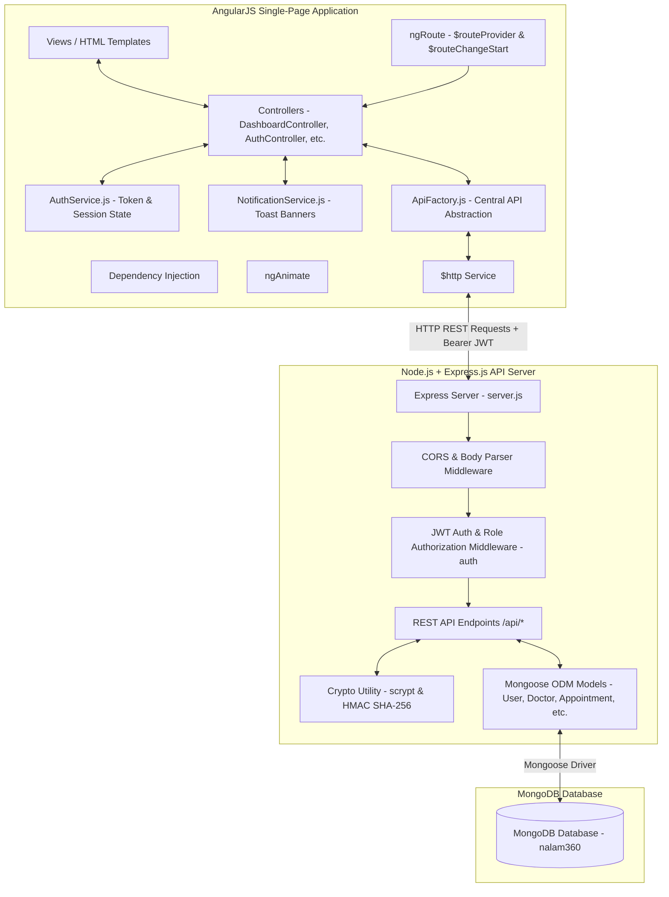

# NALAM360 — Technical Defense & Survival Report

---

# 1. PROJECT ONE-LINE EXPLANATION

```text
NALAM360 is a rural healthcare access platform that connects patients,
doctors, and administrators through an AngularJS single-page application (SPA)
frontend and a Node.js + Express.js + MongoDB REST API backend.
```

### Problem Solved
Rural populations face severe challenges accessing primary healthcare due to geographical isolation, doctor unavailability, and poor prescription adherence. **NALAM360** bridges this gap by enabling rural villagers to locate nearby primary health centers (PHCs), book consultation appointments with verified token numbers, organize daily medication dosages, view village health screening camps, and access 24/7 emergency hotline assistance.

---

# 2. COMPLETE APPLICATION FLOW

```mermaid
flowchart TD
    AppLaunch[Application Launch at /] --> CheckAuth{Is User Logged In?}
    CheckAuth -- No --> Onboarding[/onboarding Screen]
    Onboarding --> GetStarted[Click Get Started]
    GetStarted --> Login[/login Screen]
    CheckAuth -- Yes --> RoleCheck{Detect User Role}
    
    Login --> SubmitAuth[Submit Credentials]
    SubmitAuth --> AuthAPI[POST /api/auth/login]
    AuthAPI --> Verify[Verify Password Hash & Issue JWT]
    Verify --> StoreSession[Store Token & Session in localStorage]
    StoreSession --> RoleCheck
    
    RoleCheck -- role: patient --> PatientDash[/patient/dashboard]
    RoleCheck -- role: doctor --> DoctorDash[/doctor/dashboard]
    RoleCheck -- role: admin --> AdminDash[/admin/dashboard]
    
    SignOut[Click Sign Out] --> ClearSession[Clear Token & Session in localStorage]
    ClearSession --> Onboarding
```

### Detailed Flow Behavior
1. **First-Time / Unauthenticated Visitor**: Opens `http://localhost:3000/`. The AngularJS `$routeProvider` default rule (`.otherwise()`) detects no active user session (`AuthService.isLoggedIn() === false`) and lands on the `/onboarding` welcome screen.
2. **Onboarding to Login**: Clicking *"Get Started with Nalam360"* marks onboarding completed and routes to `/login`.
3. **Authentication & Role Detection**:
   - The user selects their role tab (*Patient*, *Doctor*, or *Admin*) and submits credentials.
   - Express verifies the password using `scryptSync` against the stored salt hash.
   - Upon success, Express returns a Bearer JWT token. `AuthService` stores the token (`nalam360_access_token`) and user object (`nalam360_active_session`) in `localStorage`.
   - The AngularJS `$routeChangeStart` guard detects `user.role` and redirects to the appropriate workspace (`/patient/dashboard`, `/doctor/dashboard`, or `/admin/dashboard`).
4. **Returning Authenticated User**: If a user visits the application with a valid session in `localStorage`, `app.js` route guard bypasses onboarding and redirects directly to their role dashboard.
5. **Sign Out**: Clicking *"Sign Out"* calls `AuthService.logout()`, clearing `localStorage` and redirecting back to `/onboarding`.

---

# 3. FULL TECHNICAL ARCHITECTURE



---

# 4. FRONTEND FOLDER STRUCTURE

```text
Nalam360/
├── css/
│   └── style.css            # Global CSS Design System & Theme Variables
├── js/
│   ├── app.js               # Main AngularJS Module & Route Definitions ($routeProvider)
│   ├── controllers/         # Page Controllers (Main, Auth, Patient, Doctor, Admin)
│   ├── directives/          # Custom Directives (loadingSpinner, emptyState, statusPill, vitalsCanvas)
│   ├── filters/             # Custom Pipes (statusLabel, initials, villageFilter)
│   └── services/            # Service Layer (ApiFactory, AuthService, NotificationService)
├── views/                   # Role-Namespaced HTML Views
│   ├── admin/               # Admin Workspace (dashboard, users, doctors, camps, awareness, emergency, profile)
│   ├── auth/                # Auth Templates (login, register)
│   ├── doctor/              # Doctor Workspace (dashboard, patients, appointments, camps, awareness, emergency, profile)
│   ├── onboarding/          # Visitor Landing View (onboarding)
│   ├── patient/             # Patient Workspace (dashboard, healthcare, doctors, appointments, reminders, camps, awareness, emergency, profile)
│   └── shared/              # Shared Views (access-denied)
├── index.html               # Main Single-Page App Container Shell
├── server.js                # Express.js Server, REST Endpoints & Mongoose Models
└── .env                     # Environment Variables (PORT, MONGO_URI, TOKEN_SECRET)
```

### Why Role-Based Folder Namespacing is Used
1. **Security & Authorization Isolation**: Enforces strict separation of concern between Patient, Doctor, and Admin views.
2. **Maintainability**: Prevents naming collisions (e.g. `patient/appointments.html` vs `doctor/appointments.html`).
3. **Role Routing Cleanliness**: Allows `$routeProvider` to cleanly enforce `roles: ['doctor']` or `roles: ['admin']`.

---

# 5. ANGULARJS CORE CONCEPTS USED

### AngularJS Module
Declares the root application module and injects `ngRoute` and `ngAnimate`.
```javascript
// js/app.js
var app = angular.module('Nalam360App', ['ngRoute', 'ngAnimate']);
```
- **Viva Answer**: *"The module is the main container for the AngularJS application where routes, controllers, services, and directives are registered."*

### Controllers
Handles view-level logic, user events, and scope binding.
```javascript
// js/controllers/AppointmentController.js
angular.module('Nalam360App').controller('AppointmentController', [
  '$scope', 'ApiFactory', 'NotificationService',
  function ($scope, ApiFactory, NotificationService) { ... }
]);
```
- **Viva Answer**: *"Controllers manage the view-level state, capture user actions, and invoke ApiFactory services."*

### Dependency Injection
Passes services (`$scope`, `$http`, `AuthService`) as parameters into functions.
```javascript
angular.module('Nalam360App').factory('AuthService', ['ApiFactory', '$window', function (ApiFactory, $window) { ... }]);
```
- **Viva Answer**: *"Dependency Injection automatically provides required services to controllers and factories, keeping code decoupled and testable."*

### `$scope`
Acts as the glue between controller logic and HTML views.
```javascript
$scope.user = AuthService.state.currentUser;
```
- **Viva Answer**: *"`$scope` is the execution context for expression evaluation that connects JavaScript controllers with HTML templates."*

### `ng-model`
Binds form controls to JavaScript models (two-way data binding).
```html
<!-- views/auth/login.html -->
<input type="text" class="form-control" ng-model="loginForm.identity" required/>
```
- **Viva Answer**: *"`ng-model` provides two-way data binding, synchronizing form inputs automatically with scope properties."*

### `ng-repeat`
Renders a list of items over an array.
```html
<!-- views/patient/appointments.html -->
<div class="card" ng-repeat="item in appointments">
  <h4>{{ item.doctorName }}</h4>
</div>
```
- **Viva Answer**: *"`ng-repeat` iterates over collections to dynamically generate repeated DOM elements."*

### `ng-if`
Conditionally mounts or unmounts DOM nodes based on boolean expressions.
```html
<loading-spinner message="Loading care directory..." ng-if="loading"></loading-spinner>
```
- **Viva Answer**: *"`ng-if` removes or recreates DOM elements based on boolean conditions to optimize DOM rendering."*

### `ng-click` & `ng-submit`
Triggers scope methods on user interaction or form submission.
```html
<form ng-submit="submitLogin()">
  <button type="submit" ng-click="selectRole('patient')">Patient</button>
</form>
```
- **Viva Answer**: *"`ng-submit` handles form submission while preventing page reloads, and `ng-click` handles click events."*

### Forms and Validation
Provides real-time validation states (`$invalid`, `required`).
```html
<button type="submit" class="btn btn-primary" ng-disabled="loginNgForm.$invalid || loading">
  Sign In
</button>
```

### `$routeProvider`
Maps URLs to HTML templates and controllers in the AngularJS SPA.
```javascript
// js/app.js
$routeProvider.when('/patient/appointments', {
  templateUrl: 'views/patient/appointments.html',
  controller: 'AppointmentController',
  requiresAuth: true,
  roles: ['patient']
});
```
- **Viva Answer**: *"`$routeProvider` enables client-side SPA routing without full page refreshes."*

### Route Guards (`$routeChangeStart`)
Intersects navigation events to enforce role authorization.
```javascript
// js/app.js
$rootScope.$on('$routeChangeStart', function (event, next) {
  if (next && next.requiresAuth && !AuthService.isLoggedIn()) {
    event.preventDefault();
    $location.path('/onboarding');
  }
});
```
- **Viva Answer**: *"The `$routeChangeStart` event listener intercepts route transitions to prevent unauthorized access."*

### Factory / Service (`ApiFactory`)
Centralizes API calls to the Express backend.
```javascript
// js/services/ApiFactory.js
angular.module('Nalam360App').factory('ApiFactory', ['$q', '$http', '$window', function ($q, $http, $window) {
  function request(method, url, data) {
    var token = $window.localStorage.getItem('nalam360_access_token');
    return $http({
      method: method,
      url: url,
      data: data,
      headers: token ? { Authorization: 'Bearer ' + token } : {}
    }).then(function (res) { return res.data; });
  }
  return {
    getDoctors: function () { return request('GET', '/api/doctors'); }
  };
}]);
```
- **Viva Answer**: *"`ApiFactory` encapsulates `$http` REST API calls into reusable promise-returning methods."*

### `$http`
Executes asynchronous REST API HTTP requests.
```javascript
$http({ method: 'POST', url: '/api/appointments', data: bookingPayload })
```
- **Viva Answer**: *"`$http` is the AngularJS core service used to communicate with the Express REST API."*

### Custom Directives
Specialized reusable components implemented in `js/directives/directives.js`:
1. `<status-pill value="status">`: Renders styled status badges (`scheduled`, `completed`, `cancelled`).
2. `<loading-spinner message="...">`: Renders CSS animated loading state.
3. `<empty-state icon="..." title="...">`: Renders empty data fallback graphics.
4. `<vitals-canvas>`: Real-time HTML5 Canvas ECG heart rhythm waveform renderer.

### Custom Filters
Data transformers implemented in `js/filters/filters.js`:
1. `statusLabel`: Capitalizes status strings.
2. `initials`: Extracts 2-letter uppercase initials from names.
3. `villageFilter`: Filters arrays by village name.

### `ngAnimate`
Provides smooth CSS transitions (`.page-fade`) when routes or view views change.

---

# 6. IMPORTANT HTML / UI / MEDIA ELEMENTS

| Element | Actual Usage | Why Used | Snippet |
| ------- | ------------ | -------- | ------- |
| `<form>` | Auth & Booking forms | Groups controls & captures `ng-submit` | `<form ng-submit="submitLogin()">` |
| `<input>` | Identity, password, dates | Accepts text, date, and password inputs | `<input type="date" ng-model="bookingForm.date"/>` |
| `<select>` & `<option>` | Specialty & Village selection | Provides dropdown selections | `<select ng-model="selectedSpecialty">` |
| `<table>`, `<tr>`, `<td>` | Admin User Directory | Displays tabular account data | `<table><tr ng-repeat="u in users">` |
| `` | Healthcare clinic & camp headers | Displays Unsplash healthcare images | `` |
| `<canvas>` | Patient Dashboard Vitals | Renders animated ECG cardiac pulse waves | `<vitals-canvas></vitals-canvas>` |
| `<meter>` | Patient Dashboard Telemetry | Displays HTML5 visual meter gauges for Heart Rate, BP, SpO2 | `<meter min="40" max="140" value="72"></meter>` |
| `<header>`, `<nav>`, `<aside>`, `<main>` | Platform Shell Layout | HTML5 semantic structure | `<header class="app-header">`, `<aside class="app-sidebar">` |

> **Note on Canva & Video Assets**: Canva was used as a graphical design tool to export image assets (`.jpg`/`.png`) used in the UI. Canva is a design platform, not an HTML tag. Video calling/WebRTC is not implemented in this scope.

---

# 7. CSS / DESIGN SYSTEM

Implemented in `css/style.css` using vanilla CSS custom properties (variables):

```css
:root {
  --primary: #00645a;          /* Rural Health Deep Teal */
  --primary-container: #087f73;
  --secondary: #0058bb;        /* Clinical Blue */
  --surface-bg: #f0fdfa;       /* Soft Mint Surface */
  --surface-card: #ffffff;
  --surface-border: #d1e5e1;
  --text-main: #02201c;
  --font-heading: 'Plus Jakarta Sans', sans-serif;
  --font-body: 'Inter', sans-serif;
  --radius-md: 12px;
  --shadow-md: 0 4px 12px rgba(2, 32, 28, 0.08);
}
```
- **Why Useful**: CSS variables maintain brand consistency across cards, pills, forms, and glassmorphism headers, while supporting flexbox and CSS grid responsive design.

---

# 8. PATIENT WORKFLOW — APPOINTMENT BOOKING

```text
[Patient]
   ↓ Click "Book Visit" on Doctor Card
[HealthcareController.js]
   ↓ $scope.openBookingModal(doc) -> Opens Modal
[Patient Selects Date & Time]
   ↓ Click "Confirm Appointment"
[HealthcareController.js]
   ↓ $scope.confirmBooking()
[ApiFactory.js]
   ↓ ApiFactory.createAppointment(bookingPayload)
[$http Service]
   ↓ POST /api/appointments + Bearer JWT Header
[server.js - Express API]
   ↓ auth() Middleware verifies JWT token & patient role
[Appointment.create()]
   ↓ Mongoose saves document in MongoDB `appointments` collection
[MongoDB]
   ↓ Responds with created appointment object (including token: "NALAM-48291")
[AngularJS UI]
   ↓ Closes Modal, displays success Toast notification, & updates UI schedule list
```

---

# 9. PATIENT MEDICATION FLOW

1. **Add Reminder**: Patient opens `/patient/reminders`, fills medicine name, slot (*Morning*, *Afternoon*, *Night*), and clicks *"Save Reminder"*. `ApiFactory.createReminder()` sends `POST /api/reminders`.
2. **Toggle Completion**: Clicking the status circle fires `toggleReminder(rem)`, sending `PUT /api/reminders/:id`. Express toggles `completed: true/false` in MongoDB.

---

# 10. HEALTH CAMPS FLOW

1. **Admin Creation**: Admin posts camp details via `POST /api/camps`. Express creates a `Camp` document in MongoDB.
2. **Patient Browsing & Interest Registration**: Patient views `/patient/camps`. Clicking *"Register Interest"* triggers `POST /api/camps/:id/register`. Express updates `registeredUsers` and increments `registeredCount` in MongoDB.

---

# 11. DOCTOR WORKFLOW

1. **Doctor Sign In**: Doctor signs in with email/mobile and password. Express issues a JWT containing `role: 'doctor'`.
2. **Workspace Access**: Directed to `/doctor/dashboard` and `/doctor/appointments`.
3. **Patient Queue & Status Update**: Doctor views assigned appointments. Clicking *"Mark Completed"* sends `PUT /api/appointments/:id` with `{ status: 'completed' }`, updating MongoDB.

---

# 12. ADMIN WORKFLOW

1. **Admin Access**: Authenticates as `admin@nalam360.test`. Accesses `/admin/dashboard`, `/admin/users`, and `/admin/doctors`.
2. **Doctor Account Creation**: Admin opens `/admin/doctors`, clicks *"Add New Doctor Account"*, enters Doctor Name, Specialty, Village, Email, Mobile, and Password.
3. **MongoDB Synchronization**: `POST /api/doctors` creates BOTH a `Doctor` document AND a `User` account (`role: 'doctor'`) hashed with `scrypt`, enabling the doctor to log in immediately.

---

# 13. AUTHENTICATION & JWT SECURITY

```javascript
// Express JWT Encoding in server.js
function encodeToken(payload) {
  const body = Buffer.from(JSON.stringify(payload)).toString('base64url');
  const signature = crypto.createHmac('sha256', TOKEN_SECRET).update(body).digest('base64url');
  return `${body}.${signature}`;
}
```
- **Login Flow**: `POST /api/auth/login` validates credentials -> returns JWT token string.
- **Header Transmission**: AngularJS `ApiFactory.js` attaches `Authorization: Bearer <token>` to every `$http` request.
- **Express Middleware**: `auth(requiredRoles)` decodes JWT, verifies HMAC SHA-256 signature, checks token expiry (`exp`), and enforces role permissions.

---

# 14. PASSWORD HASHING

Passwords are hashed using Node.js native `crypto.scryptSync` with random 16-byte salt strings:
```javascript
// server.js
function createPasswordHash(password) {
  const salt = crypto.randomBytes(16).toString('hex');
  const hash = crypto.scryptSync(password, salt, 64).toString('hex');
  return `${salt}:${hash}`;
}
```
- **Verification**: On login, the stored salt is extracted to re-hash the incoming password and checked using `crypto.timingSafeEqual`.

---

# 15. EXPRESS.JS REST API ENDPOINTS

| Method | Endpoint | Purpose | Allowed Roles |
| ------ | -------- | ------- | ------------- |
| `GET` | `/api/health` | Server & Mongo Connection Health Check | Public |
| `POST` | `/api/auth/register` | Self-register new Patient account | Public |
| `POST` | `/api/auth/login` | Authenticate user & issue JWT token | Public |
| `GET` | `/api/auth/me` | Fetch active user profile | Authenticated |
| `PUT` | `/api/auth/me` | Update user profile details | Authenticated |
| `POST` | `/api/auth/logout` | Invalidate active user session | Authenticated |
| `GET` | `/api/doctors` | Fetch list of doctors (with filters) | Authenticated |
| `POST` | `/api/doctors` | Create Doctor profile & login account | `admin` |
| `PUT` | `/api/doctors/:id` | Update Doctor profile & password | `admin` |
| `DELETE` | `/api/doctors/:id` | Delete Doctor profile & login account | `admin` |
| `GET` | `/api/appointments` | Fetch role-scoped appointments | Authenticated |
| `POST` | `/api/appointments` | Book new consultation appointment | Authenticated |
| `PUT` | `/api/appointments/:id` | Update appointment status | Authenticated |
| `DELETE` | `/api/appointments/:id` | Cancel appointment | Authenticated |
| `GET` | `/api/reminders` | Fetch patient medication reminders | Authenticated |
| `POST` | `/api/reminders` | Add medication reminder | Authenticated |
| `PUT` | `/api/reminders/:id` | Toggle reminder completion status | Authenticated |
| `DELETE` | `/api/reminders/:id` | Delete medication reminder | Authenticated |
| `GET` | `/api/camps` | Fetch health screening camps | Authenticated |
| `POST` | `/api/camps` | Create new health camp | `admin` |
| `POST` | `/api/camps/:id/register` | Toggle patient camp registration | Authenticated |
| `DELETE` | `/api/camps/:id` | Delete health camp | `admin` |
| `GET` | `/api/awareness` | Fetch health awareness guides | Authenticated |
| `GET` | `/api/patients` | Fetch patient roster | `doctor`, `admin` |
| `GET` | `/api/users` | Fetch all system user accounts | `admin` |
| `GET` | `/api/admin/summary` | Fetch system metrics summary | `admin` |

---

# 16. MONGODB + MONGOOSE SCHEMAS & DATABASE TABLES

Connected in `server.js` using Mongoose ODM driver:
```javascript
const MONGO_URI = process.env.MONGO_URI || 'mongodb://127.0.0.1:27017/nalam360';
mongoose.connect(MONGO_URI, { serverSelectionTimeoutMS: 5000 });
```

### Database Collections & Schema Definitions

#### 1. `users` Collection Schema (`User` Model)
Stores all authenticated user accounts (Patients, Doctors, Administrators).

| Field | BSON Type | Constraints / Options | Description / Purpose |
| ----- | --------- | --------------------- | --------------------- |
| `_id` | `ObjectId` | Primary Key, Auto-generated | Unique document identifier |
| `name` | `String` | Required, Trim, minlength: 2 | Full name of patient/doctor/admin |
| `email` | `String` | Trim, Lowercase, Indexed | User email address |
| `mobile` | `String` | Required, Unique, Trim | 10-digit mobile login identifier |
| `passwordHash` | `String` | Required | Salted `scrypt` hash string (`salt:hash`) |
| `role` | `String` | Required, Enum: `['patient', 'doctor', 'admin']` | User authorization role |
| `village` | `String` | Required, Trim | Assigned rural village sector location |
| `gender` | `String` | Trim, Default: `'Male'` | Gender specification |
| `dob` | `String` | Trim, Default: `''` | Date of birth |
| `createdAt` | `Date` | Default: `Date.now` | Account registration timestamp |

#### 2. `doctors` Collection Schema (`Doctor` Model)
Stores clinical directory profiles for medical specialists.

| Field | BSON Type | Constraints / Options | Description / Purpose |
| ----- | --------- | --------------------- | --------------------- |
| `_id` | `ObjectId` | Primary Key, Auto-generated | Unique doctor profile ID |
| `name` | `String` | Required, Trim | Doctor full name (e.g. `Dr. Arumugam K.`) |
| `email` | `String` | Trim, Lowercase | Doctor contact & login email |
| `specialty` | `String` | Required, Trim | Medical specialty (e.g. `General Medicine`) |
| `village` | `String` | Required, Trim | Primary Health Center (PHC) village |
| `experience` | `Number` | Min: 0, Default: 0 | Clinical practice experience in years |
| `fee` | `Number` | Min: 0, Default: 0 | Consultation fee in INR (₹) |
| `available` | `Boolean` | Default: `true` | Active availability status toggle |
| `initials` | `String` | Default: `'DR'` | 2-letter uppercase avatar initials |
| `nextSlot` | `String` | Default: `'Available Today'` | Next available consultation slot |
| `createdAt` | `Date` | Default: `Date.now` | Profile creation timestamp |

#### 3. `appointments` Collection Schema (`Appointment` Model)
Stores booked doctor consultation visits and token numbers.

| Field | BSON Type | Constraints / Options | Description / Purpose |
| ----- | --------- | --------------------- | --------------------- |
| `_id` | `ObjectId` | Primary Key, Auto-generated | Unique appointment record ID |
| `patientId` | `ObjectId` | Ref: `'User'`, Required | Reference to Patient `User._id` |
| `doctorId` | `ObjectId` | Ref: `'Doctor'`, Optional | Reference to assigned `Doctor._id` |
| `patientName` | `String` | Required | Patient full name snapshot |
| `doctorName` | `String` | Required | Doctor full name snapshot |
| `specialty` | `String` | Default: `'General Medicine'` | Medical specialty domain |
| `village` | `String` | Required | Consultation village sector |
| `date` | `String` | Required | Appointment date (`YYYY-MM-DD`) |
| `time` | `String` | Required | Preferred time slot (e.g. `10:30 AM`) |
| `status` | `String` | Enum: `['scheduled', 'completed', 'cancelled']` | Consultation status |
| `token` | `String` | Required, Unique | Unique booking token (e.g. `NALAM-48291`) |
| `notes` | `String` | Default: `'Routine Consultation'` | Patient consultation notes |
| `createdAt` | `Date` | Default: `Date.now` | Booking creation timestamp |

#### 4. `reminders` Collection Schema (`Reminder` Model)
Stores patient daily prescription dose tracking schedules.

| Field | BSON Type | Constraints / Options | Description / Purpose |
| ----- | --------- | --------------------- | --------------------- |
| `_id` | `ObjectId` | Primary Key, Auto-generated | Unique reminder record ID |
| `patientId` | `ObjectId` | Ref: `'User'`, Required | Reference to Patient `User._id` |
| `name` | `String` | Required, Trim | Medicine name & dosage (e.g. `Metformin 500mg`) |
| `slot` | `String` | Required, Enum: `['Morning', 'Afternoon', 'Night', 'All']` | Daily dose time slot |
| `instruction` | `String` | Trim, Default: `'Take after meals'` | Patient intake instructions |
| `completed` | `Boolean` | Default: `false` | Dose completion toggle status |
| `createdAt` | `Date` | Default: `Date.now` | Creation timestamp |

#### 5. `camps` Collection Schema (`Camp` Model)
Stores free village health screening camps and registration rosters.

| Field | BSON Type | Constraints / Options | Description / Purpose |
| ----- | --------- | --------------------- | --------------------- |
| `_id` | `ObjectId` | Primary Key, Auto-generated | Unique camp record ID |
| `title` | `String` | Required, Trim | Health camp title (e.g. `Free Village Eye Screening Camp`) |
| `village` | `String` | Required, Trim | Host village sector location |
| `date` | `String` | Required, Trim | Camp date |
| `doctor` | `String` | Required, Trim | Attending medical officer |
| `specialty` | `String` | Default: `'General Screening'` | Specialty domain |
| `description` | `String` | Required, Trim | Camp details & health services offered |
| `registeredCount` | `Number` | Default: 0 | Count of registered participants |
| `registeredUsers` | `[ObjectId]` | Ref: `'User'` | Array of Patient `User._id` references |
| `createdAt` | `Date` | Default: `Date.now` | Camp creation timestamp |

#### 6. `awareness` Collection Schema (`Awareness` Model)
Stores rural community health education articles.

| Field | BSON Type | Constraints / Options | Description / Purpose |
| ----- | --------- | --------------------- | --------------------- |
| `_id` | `ObjectId` | Primary Key, Auto-generated | Unique article record ID |
| `title` | `String` | Required, Trim | Article title |
| `category` | `String` | Required, Trim | Category (e.g. `General Health`, `Cardiology`) |
| `readTime` | `String` | Default: `'3 min read'` | Estimated reading duration |
| `snippet` | `String` | Required, Trim | Short summary excerpt |
| `content` | `String` | Required, Trim | Complete health guide text |
| `createdAt` | `Date` | Default: `Date.now` | Article creation timestamp |

---

# 17. API REQUEST / RESPONSE EXAMPLE

### Request: `POST /api/appointments`
```http
POST /api/appointments HTTP/1.1
Host: localhost:3000
Authorization: Bearer eyJpZCI6IjY2ZjE...
Content-Type: application/json

{
  "doctorId": "66f123abc...",
  "date": "2026-09-25",
  "time": "10:30 AM",
  "village": "Melur",
  "notes": "Hypertension checkup"
}
```

### Response: `201 Created`
```json
{
  "id": "66f456def...",
  "patientId": "66f789ghi...",
  "patientName": "Muthuswamy S.",
  "doctorName": "Dr. Arumugam K.",
  "specialty": "General Medicine",
  "village": "Melur",
  "date": "2026-09-25",
  "time": "10:30 AM",
  "status": "scheduled",
  "token": "NALAM-48291",
  "notes": "Hypertension checkup"
}
```

---

# 18. CODE YOU SHOULD KNOW FOR VIVA

### 1. AngularJS SPA Module & Route Guard
```javascript
// js/app.js
angular.module('Nalam360App', ['ngRoute', 'ngAnimate'])
.run(['$rootScope', '$location', 'AuthService', function($rootScope, $location, AuthService) {
  $rootScope.$on('$routeChangeStart', function(event, next) {
    if (next && next.requiresAuth && !AuthService.isLoggedIn()) {
      event.preventDefault();
      $location.path('/onboarding');
    }
  });
}]);
```
- **What to say**: *"This sets up our AngularJS SPA routing module and intercepts route changes to protect private pages from unauthenticated access."*

### 2. Express JWT Auth Middleware
```javascript
// server.js
function auth(requiredRoles) {
  return async (req, res, next) => {
    const token = (req.headers.authorization || '').replace(/^Bearer\s+/i, '');
    const payload = decodeToken(token);
    if (!payload) return res.status(401).json({ message: 'Unauthorized' });
    const user = await User.findById(payload.id).lean();
    if (requiredRoles && !requiredRoles.includes(user.role)) {
      return res.status(403).json({ message: 'Forbidden' });
    }
    req.user = user;
    next();
  };
}
```
- **What to say**: *"This Express middleware extracts the Bearer JWT token from HTTP headers, verifies signature and expiry, and enforces role permissions."*

---

# 19. COMMON VIVA QUESTIONS & SHORT ANSWERS

1. **What is NALAM360?**
   - *Answer*: "NALAM360 is a rural healthcare platform built using AngularJS, Express.js, and MongoDB to connect patients, doctors, and health admins."
2. **Why choose AngularJS for the frontend?**
   - *Answer*: "AngularJS provides client-side SPA routing (`ngRoute`), declarative HTML templates, and two-way data binding (`ng-model`)."
3. **What is two-way data binding?**
   - *Answer*: "It automatically synchronizes model values in JavaScript controllers with form input fields in HTML views."
4. **How does client-side routing work?**
   - *Answer*: "`$routeProvider` intercepts hash navigation changes and loads partial HTML templates into `<main ng-view>` without reloading the page."
5. **How is authentication secured?**
   - *Answer*: "Passwords are hashed using Node.js `scrypt` with random salt, and sessions are verified using HMAC SHA-256 JWT tokens."
6. **Where is the JWT token stored?**
   - *Answer*: "In browser `localStorage` as `nalam360_access_token` and sent in the `Authorization: Bearer <token>` header."
7. **Why is backend authorization necessary if the frontend already guards routes?**
   - *Answer*: "Frontend guards only protect UI views. Backend Express middleware (`auth()`) is essential to prevent unauthorized API requests."
8. **How does MongoDB connect to Express?**
   - *Answer*: "Through Mongoose ODM using `mongoose.connect(MONGO_URI)` in `server.js`."
9. **What is a Mongoose schema?**
   - *Answer*: "A schema defines the structure, data types, and validation constraints for documents in a MongoDB collection."
10. **How are appointments booked?**
    - *Answer*: "The patient selects a doctor and slot. `HealthcareController` calls `ApiFactory.createAppointment()`, which POSTs to Express, saving an `Appointment` document in MongoDB with a unique token number."
11. **How does Doctor login work?**
    - *Answer*: "When Admin registers a Doctor, Express creates both a `Doctor` record and a `User` account with `role: 'doctor'`, allowing login via email or mobile."
12. **What does the `<vitals-canvas>` directive do?**
    - *Answer*: "It uses the HTML5 2D Canvas API to render an animated ECG cardiac pulse waveform on the Patient Dashboard."

---

# 20. "EXPLAIN THIS FILE" CHEAT SHEET

| File | Purpose | Key Thing to Remember |
| ---- | ------- | --------------------- |
| `index.html` | SPA Shell Container | Contains header topbar, responsive sidebar, and `<main ng-view>` workspace. |
| `js/app.js` | AngularJS App & Routing | Defines `$routeProvider` routes and `$routeChangeStart` authorization listener. |
| `js/services/ApiFactory.js` | Centralized REST API Service | Uses `$http` to communicate with Express REST API and attach Bearer tokens. |
| `js/services/AuthService.js` | User State & Session Manager | Handles JWT token persistence, login/logout, and role checks. |
| `js/directives/directives.js` | Custom UI Component Directives | Contains `<status-pill>`, `<loading-spinner>`, `<empty-state>`, and `<vitals-canvas>`. |
| `server.js` | Backend API & Database | Houses Express endpoints, JWT auth middleware, `scrypt` hashing, and Mongoose models. |
| `css/style.css` | Global Design System | Defines CSS custom properties (variables), cards, status badges, and grid layouts. |

---

# 21. 5-MINUTE TECHNICAL DEMO SCRIPT

1. **Step 1: Launch & Onboarding (`/#/onboarding`)**
   - *Action*: Open `http://localhost:3000/`.
   - *What to say*: "Notice that unauthenticated visitors land on our Onboarding screen. Clicking 'Get Started' routes to Login."
2. **Step 2: Patient Sign In (`/#/login`)**
   - *Action*: Select *Patient* tab, click *Sign In*.
   - *What to say*: "Express authenticates credentials, issues a JWT token, and `AuthService` stores it in `localStorage`."
3. **Step 3: Patient Dashboard & Vitals (`/#/patient/dashboard`)**
   - *Action*: Show ECG canvas waveform and telemetry meters.
   - *What to say*: "Here our custom `<vitals-canvas>` directive renders a 2D HTML5 canvas ECG pulse wave."
4. **Step 4: Book Doctor Visit (`/#/patient/healthcare`)**
   - *Action*: Search doctor, click *Book Visit*, select slot, click *Confirm*.
   - *What to say*: "`HealthcareController` calls `ApiFactory.createAppointment()`, posting JSON to Express and persisting the booking token in MongoDB."
5. **Step 5: Doctor Workspace (`/#/doctor/dashboard`)**
   - *Action*: Sign out, sign in as Doctor (`doctor@nalam360.test`). View appointments.
   - *What to say*: "Notice our role guard loaded the Doctor workspace, allowing doctors to view scheduled visits."
6. **Step 6: Admin Management (`/#/admin/doctors`)**
   - *Action*: Sign in as Admin (`admin@nalam360.test`). Click *+ Add New Doctor Account*.
   - *What to say*: "Admin creates both the Doctor profile and their login user account in MongoDB simultaneously."

---

# 22. TECHNICAL SURVIVAL — 30 SECOND ANSWER

> *"NALAM360 is a rural healthcare single-page application built on AngularJS, Express.js, and MongoDB. The frontend uses AngularJS `$routeProvider` for role-based SPA routing and `ApiFactory` to send `$http` REST requests with Bearer JWT tokens. On the backend, Express middleware verifies JWT signatures and role permissions, while passwords are secured using Node.js `scrypt` hashing with salt. Data is stored in MongoDB using Mongoose models for Patients, Doctors, Appointments, Medication Reminders, and Health Camps."*
